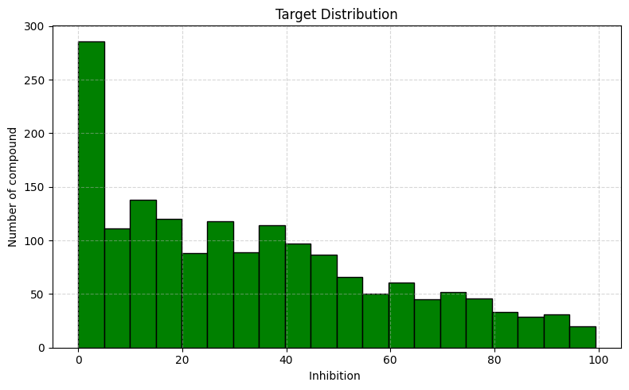
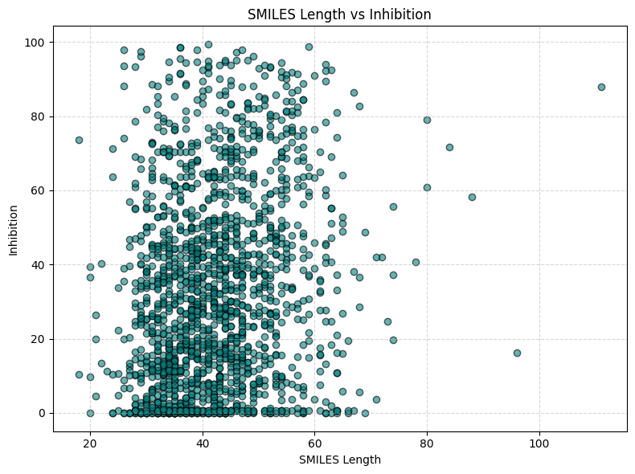
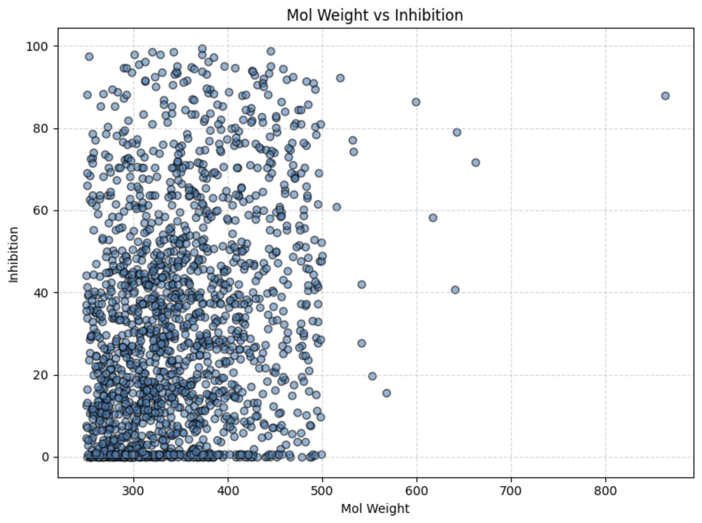

## 1. Background

With the rapid advancement of artificial intelligence (AI), data-driven predictive
models are increasingly being applied in the fields of biotechnology and drug discovery.

In particular, AI-based toxicity and metabolism prediction models can support
early-stage drug development by reducing experimental costs and identifying
high-risk compounds at an early phase.

## 2. Project Objective

The objective of this project is to develop a robust machine learning model
that predicts **CYP3A4 inhibition rates (%)** using molecular structure information alone,
and to evaluate its performance in a competitive benchmark setting.

## 3. Dataset Overview

- **Training data:** 1,681 chemical compounds
- **Inputs:** Molecular structure information (SMILES)
- **Target:** CYP3A4 inhibition rate (% inhibition, 0–100)

The dataset exhibits a **strong imbalance**, with most compounds showing
low to moderate inhibition and relatively few high-inhibition samples.

## 4. Exploratory Analysis & Key Observations

### Distribution of CYP3A4 Inhibition Rates

**Observation:**  
The inhibition rate distribution is highly imbalanced, with most compounds
exhibiting low to moderate inhibition and relatively few high-inhibition samples.

### Molecular Size vs Inhibition Rate

**Observation:**  
Molecular size-related features, including SMILES length and molecular weight, 
exhibit only weak correlations with CYP3A4 inhibition rates and show substantial dispersion.  
This suggests that inhibition behaviour cannot be adequately explained by simple size-based or linear relationships alone,
highlighting the need for structure-aware representations such as molecular fingerprints.

## 5. Data Preparation

Data preparation focused on ensuring structural validity and improving
model exposure to rare but critical high-inhibition compounds.

Key steps included:
- Validation and standardisation of SMILES strings
- Removal of invalid or duplicate molecules
- Targeted **SMILES randomisation** for compounds with inhibition rates above 70%
  to mitigate data imbalance

Molecules were represented using:
- RDKit physicochemical descriptors
- 2048-bit Morgan fingerprints

These features were concatenated into fixed-length vectors for model training.

## 6. Modelling Strategy

### Problem Formulation
- Regression task: predict continuous CYP3A4 inhibition rate (0–100)

### Models Evaluated
- **Gradient Boosting Regressor**
- **XGBoost Regressor**

These models were selected because they:
- effectively capture non-linear structure–activity relationships,
- perform well on tabular fingerprint-based features,
- provide strong baselines with reasonable interpretability.

### Evaluation Metrics

Model performance was evaluated using the official competition metric,
which balances **prediction accuracy** and **trend consistency**.

- **Normalized RMSE (A):** Measures how close the predicted inhibition rates are to the true values, normalised by the target range.
- **Pearson Correlation (B):** Evaluates how well the model captures the overall increasing and decreasing trends of inhibition rates.

The final leaderboard score equally weights these two components,
encouraging models that achieve both low prediction error and strong
alignment with true inhibition patterns.

## IV. Results – Inhibition Rate Prediction

Fingerprint-based gradient boosting models showed stable performance under cross-validation, indicating reliable learning behaviour across different data splits. The models generalised well to unseen compounds while maintaining efficient training and inference compared to more complex modelling approaches.

The final selected model achieved a local validation score of approximately 0.82 and a leaderboard score of around 0.77. This model was subsequently used to generate CYP3A4 inhibition rate predictions for previously unseen molecular compounds.

## V. Conclusion

This project demonstrates that molecular fingerprints combined with gradient boosting models can effectively predict CYP3A4 inhibition rates with reliable accuracy.
By focusing on well-established machine learning techniques, the final approach provides a strong and interpretable baseline suitable for practical drug discovery workflows.
